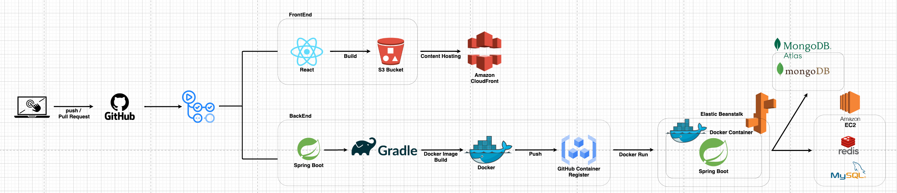
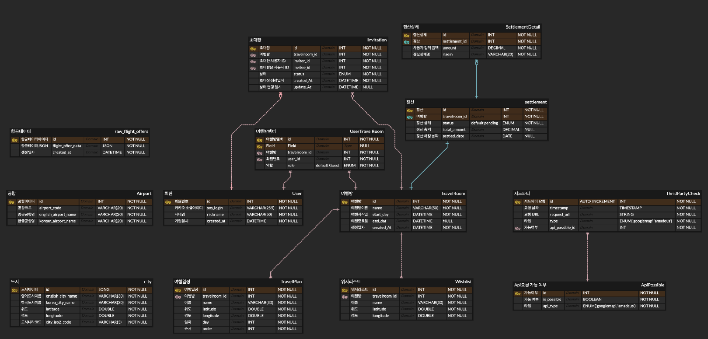

# ✈️ 여행한DAY - The Travel Day ✈️


# 🔎 서비스 소개 Introduction

---
[**여행한DAY**](https://www.thetravelday.co.kr/)는 일행과 함께 일정을 계획하고 
<br>
글로벌 운항 시스템(GDS)에서 추출한 **항공 특가 정보**를 확인 할 수 있는 
<br>
**여행 계획 공유 플랫폼**입니다.
* [React 프론트엔드 레포지토리](https://github.com/100-hours-a-week/5-CKNS-final-front)
* [Disquiet 프로덕트 소개](https://disquiet.io/product/%EC%97%AC%ED%96%89%ED%95%9Cday)

# 👨‍💻 팀원 소개 

---
| <center>이현도(PM)</center>              | <center>전연주</center>                               | <center>김준호</center>                | <center>김소민</center>                                    |
|----------------------------------|----------------------------------------------|------------------------------|---------------------------------------------------------|
| <center>Frontend, Infra</center>      | <center>Frontend, Design</center>               | <center>Backend</center>      | <center>Backend</center>                                |
| <center>[@HidenLee](https://github.com/HidenLee)</center> | <center>[@collie-jun](https://github.com/collie-jun)</center> | <center>[@sean](https://github.com/grulla79)</center> | <center>[@ss0ming](https://github.com/ss0ming)</center> |

# 📅 프로젝트 일정

---
> 2024.07.21 ~ 2024.10.06

| 스프린트  | 기간                          | 설명                                                                               |
|---------|-----------------------------|----------------------------------------------------------------------------------|
| 1       | `2024/07/22` → `2024/08/11` | 프로젝트 기획, <br/>기술 선정, <br/>기능, API 설계, <br/>ERD 설계, <br/>개발 환경 세팅, <br/>그라운드 룰 설정 |
| 2       | `2024/08/12` → `2024/08/25` | MVP 개발, <br/> 내부 QA<br/>1차 배포 및 홍보                                               |
| 3       | `2024/08/26` → `2024/09/08` | 실 서비스 운영,<br/> 사용자 피드백 반영, <br/> 부가 기능 구현                                        |
| 4       | `2024/09/09` → `2024/09/20` | 2차 배포 및 운영                                                                       |
| 5       | `2024/09/23` → `2024/10/06` | 개발 마무리, <br/> 구조 리팩토링, <br/>개발 문서 정리                                             |


[//]: # (# 📖 프로젝트 소개 Description)

[//]: # (카카오 테크 부트캠프 클라우드 네이티브 과정 파이널 프로젝트 주제로, 배포 및 디스콰이엇 홍보를 통해 )

[//]: # (실제 유저의 피드백을 받으며 진행했습니다.)


## 🕹 주요 기능️ Main Feature

---


[//]: # (## 🎥 Preview)
메인 화면| 여행방 생성                                                                                                               | 일정 추가                                                                                                                |일정 순서 변경
--- |----------------------------------------------------------------------------------------------------------------------|----------------------------------------------------------------------------------------------------------------------| --- |
 |  |  | 

## 🔧 기술 스택 Stack

---

[//]: # (### Back-End)

[//]: # (```markdown)

[//]: # (Language : Java 17)

[//]: # (Framework : SpringBoot 3.3.2)

[//]: # (```)

[//]: # ()
[//]: # (### Front-End)

[//]: # (```markdown)

[//]: # (Language: JavaScript)

[//]: # (Framework: React 18.3.1)

[//]: # (Styling: Styled-components)

[//]: # (State Management: Zustand 4.5.4)

[//]: # (Library:  )

[//]: # (- Axios 1.7.4 )

[//]: # (- STOMP 7.0.0)

[//]: # (- SockJS-client 1.6.1)

[//]: # (- Firebase 10.13.1)

[//]: # (```)

### Front-End


### Back-End


### Database


###  Push Events & Chatting


![stomp](https://img.shields.io/badge/stomp-ffffff?style=for-the-badge&logo=data:image/svg+xml;base64,PD94bWwgdmVyc2lvbj0iMS4wIiBzdGFuZGFsb25lPSJubyI/Pgo8IURPQ1RZUEUgc3ZnIFBVQkxJQyAiLS8vVzNDLy9EVEQgU1ZHIDIwMDEwOTA0Ly9FTiIKICJodHRwOi8vd3d3LnczLm9yZy9UUi8yMDAxL1JFQy1TVkctMjAwMTA5MDQvRFREL3N2ZzEwLmR0ZCI+CjxzdmcgdmVyc2lvbj0iMS4wIiB4bWxucz0iaHR0cDovL3d3dy53My5vcmcvMjAwMC9zdmciCiB3aWR0aD0iMTI4MC4wMDAwMDBwdCIgaGVpZ2h0PSI4NTMuMDAwMDAwcHQiIHZpZXdCb3g9IjAgMCAxMjgwLjAwMDAwMCA4NTMuMDAwMDAwIgogcHJlc2VydmVBc3BlY3RSYXRpbz0ieE1pZFlNaWQgbWVldCI+CjxnIHRyYW5zZm9ybT0idHJhbnNsYXRlKDAuMDAwMDAwLDg1My4wMDAwMDApIHNjYWxlKDAuMTAwMDAwLC0wLjEwMDAwMCkiCmZpbGw9IiMwMDAwMDAiIHN0cm9rZT0ibm9uZSI+CjxwYXRoIGQ9Ik02ODYwIDc2NTEgYy00MSAtMTcgLTk1IC0zNyAtMTIwIC00NiAtMjUgLTkgLTgzIC00NyAtMTI5IC04NiAtNDYKLTM4IC05MiAtNjkgLTEwMSAtNjkgLTEwIDAgLTI4IDggLTQxIDE5IC01NSA0MiAtOTEgNTMgLTE4OCA1NiAtMTE3IDMgLTEyMCA0Ci0zMDMgNzIgLTE0NCA1NSAtMTQ4IDU1IC0xOTMgNDMgLTI1IC03IC03NSAtMzAgLTExMCAtNTEgLTc0IC00NSAtODkgLTQ2Ci0xODEgLTE4IC05MSAyOCAtMTc5IDI3IC0yNzYgLTQgLTk0IC0zMCAtMTY3IC04MSAtMzA4IC0yMTQgLTU4IC01NCAtMTQ1Ci0xMzIgLTE5NSAtMTczIC00OSAtNDEgLTEyNCAtMTA0IC0xNjUgLTE0MCAtODEgLTcyIC0xODIgLTE1MCAtMjE2IC0xNjggLTE2Ci04IC03OCAtMTAgLTIxMSAtNSAtMjA1IDcgLTI5OCAtMiAtNDQzIC00MSAtNDcgLTEzIC0xMDkgLTM1IC0xMzggLTUwIC02MQotMzEgLTI4NCAtMTIxIC0zMjUgLTEzMSAtMzAgLTggLTU0IC0zIC0yNTQgNTcgLTMwMSA4OSAtNDAxIDE1MCAtNjU1IDM5OAotMjA1IDIwMSAtMjc2IDI0OSAtNDMzIDI5MiAtOTUgMjUgLTM3NiA0NSAtNDQ3IDMwIC0xNTUgLTMxIC0yMzUgLTkwIC0zMDAKLTIyMyAtNDAgLTc5IC01MCAtMTU3IC0yOCAtMjAwIDggLTEzIDYgLTcyIC01IC0xOTYgLTIxIC0yMzcgLTI3IC0yNjcgLTcwCi0zMTQgLTYwIC02NyAtMTEyIC0xODQgLTE5MCAtNDI5IC0xNSAtNDcgLTQwIC0xMDggLTU2IC0xMzYgLTE5IC0zMyAtMzMgLTc3Ci0zOCAtMTIwIC01IC0zOCAtMTkgLTk2IC0zMSAtMTI5IC0yOCAtNzggLTQyIC0yNzMgLTM0IC00NjAgNiAtMTI3IDQgLTE1MgotMjAgLTI2NiAtMTQgLTcwIC0yNiAtMTUwIC0yNiAtMTc5IDAgLTI4IC03IC02NCAtMTUgLTc4IC0zNyAtNjcgLTEyNCAtMjY0Ci0xNDUgLTMyNiAtMTkgLTU5IC0yMiAtODIgLTE3IC0xNjAgMyAtNTAgMTMgLTExNSAyMiAtMTQ0IGwxNiAtNTMgLTM2IC01NQpjLTcxIC0xMDYgLTEwNSAtMTkyIC0xNDEgLTM0OCAtNDYgLTE5OSAtNTEgLTI4MCAtMjUgLTQyNCAxNiAtOTAgMzEgLTEzOCA3NAotMjMyIDMwIC02NSA3MSAtMTQzIDkxIC0xNzMgNDcgLTcxIDE1MSAtMTU2IDI0NiAtMjAxIDg1IC00MSAxMzQgLTQ1IDMzMyAtMjYKMTAzIDEwIDExMCA5IDEzOCAtMTAgMTYgLTEyIDI5IC0yOCAyOSAtMzUgMCAtMjYgNTEgLTEzMCA3NyAtMTU3IDM2IC0zOCA2MAotNDUgMjI4IC02NyAyNDMgLTMxIDQwMSAtNDQgNDc5IC0zOCAxMDQgOCA1NjAgMTMwIDU5MCAxNTggMjAgMTggNDkgOCA4NyAtMzIKMjEgLTIyIDM5IC00NyAzOSAtNTUgMCAtMjAgNzcgLTEwMiAxMTQgLTEyMSA0NSAtMjMgNDA1IC0xMiA1MzAgMTYgMTA3IDI1CjE4MiA1MiAyMzQgODUgMjYgMTYgODQgMzMgMTczIDUxIDc0IDE1IDE5NyA0MyAyNzQgNjIgMTM5IDM2IDE0MSAzNiA0MDUgNDEKMjg5IDUgNTA3IC04IDY0MiAtMzggNDYgLTEwIDE1MyAtMzQgMjM4IC01NCA4NSAtMjAgMTgxIC0zOSAyMTQgLTQzIDQ3IC01IDYzCi0xMiA4NCAtMzUgMzMgLTM3IDE1MyAtMTAyIDI0NCAtMTMyIDczIC0yNCA3MyAtMjQgMTA3IC01IDM3IDIyIDYxIDEzIDYxIC0yMgowIC0yNyAzMiAtNDQgMTUzIC03OCAyMDUgLTU5IDI5NyAtNzcgNzEyIC0xMzcgMjYxIC0zOCA0MTIgLTUxIDQ2NyAtNDAgNDMgOAoyMDIgMTEyIDMxNSAyMDcgNDUgMzggOTAgNjkgMTAxIDY5IDEwIDAgMzMgLTE4IDUwIC0zOSAxOSAtMjQgNDkgLTQ2IDc2IC01Ngo0NCAtMTcgNDUgLTE4IDUyIC03NCAxNSAtMTI1IDM5IC0xMzcgMjc0IC0xMzMgMjM0IDMgMjU4IDExIDM1OSAxMDggNDMgNDEgOTEKOTIgMTA2IDExNCAzOCA1NSA2MCA1MCA2MSAtMTUgNCAtMTc2IDMgLTE3NSAxNDkgLTE3NSAxMzcgMCA0MDIgMjggNDM3IDQ2IDE1CjggNDAgMzEgNTUgNTEgMTUgMjAgNDcgNTcgNjkgODIgMjMgMjUgNDkgNjAgNTggNzggOSAxOCAyNSAzNyAzNyA0MyAxMSA2IDM0CjMzIDUwIDYwIDI1IDQwIDM4IDUyIDcwIDYwIDUxIDE0IDc2IDYgMTE2IC0zNiAyNyAtMjkgMzYgLTMyIDY3IC0yNyAzNCA1IDM3CjQgNTEgLTMxIDEzIC0zMSAyOCAtNDMgODggLTcyIDM5IC0xOSA4NiAtMzQgMTA0IC0zNCA1NCAwIDI1MSA4NSAzMjEgMTM4IDIwCjE1IDQ5IDU3IDczIDEwNCA0NyA5NCA2NSAxMDIgMTQyIDY3IDc4IC0zNyAxNjAgLTMyIDI2MiAxNSAxMTMgNTIgMjMyIDEyNAoyNTUgMTUzIDE3IDIxIDIwIDQxIDIwIDExMiAwIDgzIDEgODkgMjkgMTE1IDE1IDE1IDM0IDQ2IDQwIDY5IDI1IDg1IDU5IDEwOAo5NiA2NyAxMCAtMTEgMzUgLTIzIDU2IC0yNiAyNiAtNSA0MCAtMTMgNDUgLTI2IDUgLTE3IDExIC0xOSA0MyAtMTMgNDIgOSA3Ngo5IDE1MiAwIGw1NiAtNyAxNDIgMTI3IDE0MSAxMjggLTYgNDggYy02IDQyIC00IDUwIDE5IDczIDE5IDE5IDM3IDI2IDY1IDI2CjM1IDAgNDQgNiA4OSA1OCAxMzMgMTUzIDE2MyAxOTYgMTU3IDIyNSAtOCAzNyAxNiA3MSA2NyA5NyA0NSAyMyA2OSA2NiA2OQoxMjMgMCAyMiA4IDQxIDIxIDUzIDEyIDEwIDMwIDM4IDQwIDYwIDE4IDM5IDE4IDQ0IDIgODkgLTE1IDQ1IC0xNSA1MCAyIDgxCjQwIDc1IC0zIDU5NSAtNTkgNzE5IC0zMSA2OCAtNzAgMTEyIC0xMjUgMTM5IC0yNSAxMyAtNTUgMzQgLTY2IDQ2IC0zNCAzOQotMjA5IDE2MiAtMzEzIDIyMyAtOTEgNTEgLTEwNiA1NyAtMTU5IDU3IC0zMiAwIC05NSA3IC0xNDAgMTQgLTMyNiA1OCAtNDQ1CjY4IC0xMTAzIDk2IC0yMTMgOSAtNDIxIDM3IC02MzUgODUgLTYwIDE0IC0xNDggMzIgLTE5NSA0MCAtMTA5IDE5IC0yOTEgNTMKLTM1NSA2NyAtMTAwIDIxIC0xMDkgMjkgLTE2MCAxMjcgLTc0IDE0NCAtMTMyIDE3NiAtMjI2IDEyOCAtNDIgLTIzIC01MyAtMjUKLTc3IC0xNSAtMTUgNyAtOTEgMTIgLTE3NyAxNCAtMTMxIDEgLTE1NiA0IC0xOTIgMjIgLTUwIDI2IC04OSA3MSAtOTggMTE0Ci0xNiA4NCAtNDkgMTE2IC0xNTIgMTQ3IC02OSAyMSAtMTM0IDUzIC0xNTMgNzYgLTcgOSAtMTcgNDEgLTIxIDcyIC05IDY4IC0zNQo5OCAtOTggMTEzIC02NiAxNSAtMTM0IDAgLTE3NSAtMzkgLTE3IC0xNyAtMzcgLTMxIC00NCAtMzEgLTExIDAgLTU1IDEyOSAtNjcKMjAyIC00IDIzIC0xIDU4IDEwIDk0IDM0IDExOCAyMyAxNzIgLTU4IDI3NyAtMzUgNDUgLTExMiA4NyAtMTYwIDg3IC0zMSAwCi0zNiA0IC01MSA0NSAtMTAgMjQgLTQwIDc5IC02OCAxMjEgLTI4IDQyIC01MCA4NiAtNTAgOTggMCAxMSA5IDQyIDIwIDY4IDI3CjYyIDM2IDE2OSAxOCAyMTMgLTI3IDYzIC05NSAxMjYgLTE4NiAxNjkgLTc0IDM1IC05NSA0MSAtMTY1IDQzIC02OSAyIC05MSAtMQotMTU1IC0yNnogbTIzMyAtMTM1IGM0NiAtMTkgNzQgLTU0IDk3IC0xMTkgMjkgLTgzIDI3IC05NiAtMzEgLTE1MiAtMjggLTI4Ci02OCAtNzUgLTg5IC0xMDUgLTM2IC01MyAtNDUgLTU5IC0yMzEgLTE1NCAtMTA3IC01NCAtMjA2IC0xMDcgLTIyMSAtMTE3IC0zMQotMjIgLTg4IC0zNiAtODggLTIyIDAgNSAxMyAzNiAyOSA2OSA0NiA5MiA2MyAxOTIgNTAgMjk5IGwtMTAgODkgNDMgNDQgYzg4CjkxIDIxMSAxNTEgMzUxIDE3MiAyOSA0IDU2IDggNjAgOSA0IDAgMjIgLTUgNDAgLTEzeiBtLTk5NCAtMTAxIGM1MSAtMTQgMTE2Ci0yNSAxNDQgLTI1IDk2IC0xIDE1MyAtMjMgMTQxIC01NSAtMyAtNyAtNTAgLTI5IC0xMDUgLTUwIC01NSAtMjEgLTExNiAtNTAKLTEzNiAtNjYgLTE5IC0xNiAtNDIgLTI5IC00OSAtMjkgLTI2IDAgLTY5IDIyIC0xMDQgNTQgLTIxIDE4IC02OSA1MiAtMTA3IDc1Ci0xMzEgNzggLTE0NSAxMTcgLTQ2IDEyNCA4OSA2IDE2MiAtMSAyNjIgLTI4eiBtMzY3IC0yNjkgYzggLTIyIC0xNSAtOTQgLTMzCi0xMDUgLTIyIC0xMiAtMTEzIDM3IC0xMTMgNjAgMCAxMCAxOSAyNSA0OCAzNyA1NSAyNSA5MCAyOCA5OCA4eiBtNzQ4IC0xODkKYzE0IC0xOCAzMCAtNTcgMzcgLTg2IDE1IC03MCA2IC03OCAtMTQxIC0xMjYgLTYzIC0yMSAtMTI3IC00NCAtMTQyIC01MiAtMjQKLTEyIC0zMiAtMTEgLTU5IDIgLTI0IDEzIC0zMCAyMiAtMjcgNDMgMiAyMSAxNyAzNCA3OCA2NyA3NyA0MyA5NiA1OCAxNjggMTM4CjI0IDI2IDQ3IDQ3IDUyIDQ3IDUgMCAyMCAtMTUgMzQgLTMzeiBtLTExIC0zODYgYy01IC0zNyAtMzIgLTkxIC00NiAtOTEgLTggMAotMjAgMTQgLTI4IDMxIC0xMiAzMCAtMTEgMzMgMjIgNjAgMzggMzIgNTUgMzIgNTIgMHoiLz4KPC9nPgo8L3N2Zz4K&logoColor=white)

### AWS Server


### CI/CD & Infra Tools


### Storage


### Collaboration Tools


### Issue & Configuration Management


### Monitoring


## 🗺 서비스 아키텍처 Architecture

---


## 📝 데이터베이스 설계 ERD

---


## ✅ 개발 문서 

- Notion : [팀 노션](https://goormkdx.notion.site/4-DAY-7f984f2c8d2949c6857ed19164cd2cf5?pvs=4)